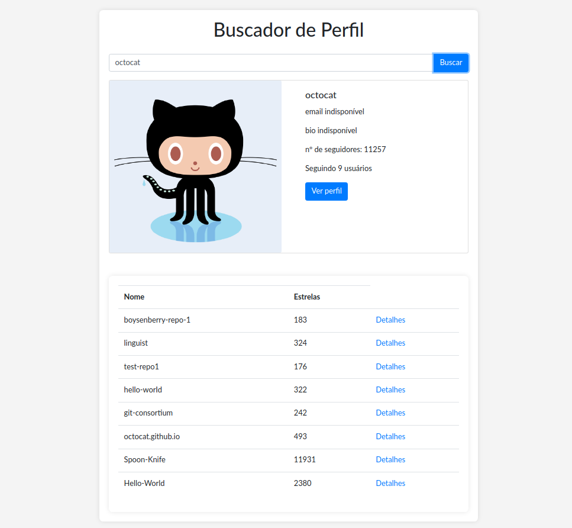

# Buscador de perfil

Projeto para visualizar os repositórios de um usuário.

## Índice

- [Start](#start)
- [Tecnologias](#tecnologias)
- [Funcionalidades](#Funcionalidades)

## Uso

Para utilizar a aplicação basta baixar o projeto e abrir o arquivo index.html no navegador.

## Tecnologias

- Html, CSS e Javascript para a construção da estrutura das páginas.
- Jquery para manipular os elementos HTML.
- Axios para as requisições.

## Funcionalidades

### Tela inicial

### Busca por um usuário e mostra os repositório

### Clique no header da coluna para reordenar a lista

### Clique em 'Detalhes' para acessar a página com detalhes do repositório

